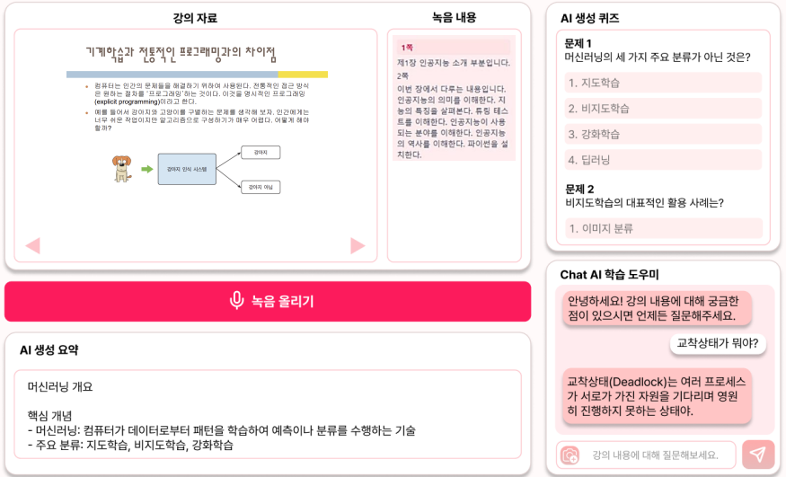
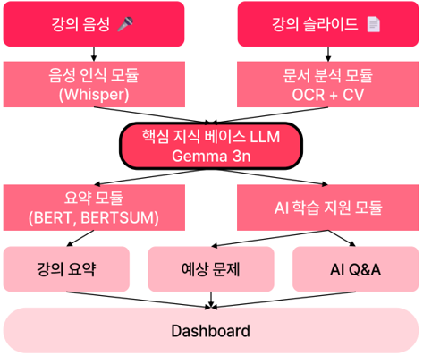
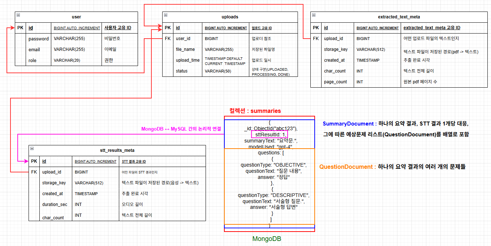

# 음성·문서 기반 교육 콘텐츠 자동화 플랫폼 - Backend API

> Capstone Design 경진대회 프로젝트 (2024)
>
> PDF 문서와 음성 파일을 업로드하면 OCR / STT → 텍스트 추출 → NLP 요약 → 문제 자동 생성까지 처리하는 REST API 백엔드 서버입니다.

| 역할 | 담당 |
|---|---|
| Backend | 본인 (Spring Boot API 서버 설계 및 개발) |
| OCR | 팀원 |
| NLP | 팀원 |
| Frontend | 팀원 |

---

## 실행 화면



---

## 기술 스택

| 카테고리 | 기술 |
|---|---|
| Language | Java 17 |
| Framework | Spring Boot 3.3.2 |
| Security | Spring Security, JWT (HttpOnly Cookie) |
| Persistence | Spring Data JPA, Spring Data MongoDB |
| Database | MySQL 8, MongoDB |
| HTTP Client | Spring WebFlux (WebClient) |
| Document Processing | Apache PDFBox 2.0.30, Apache Tika 2.9.2 |
| API Docs | SpringDoc OpenAPI (Swagger UI) |

---

## 시스템 아키텍처



### 백엔드 서버 내부 구조

```
클라이언트
    │
    ▼
Security Filter (JWT 검증)
    │
    ▼
┌───────────────────────────────────────────────────┐
│                Spring Boot API 서버               │
│                                                   │
│  ┌────────────┐   ┌──────────┐   ┌────────────┐   │
│  │ Controller │ → │ Service  │ → │ Repository │   │
│  └────────────┘   └──────┬───┘   └─────┬──────┘   │
│                          │        ┌────┴────┐     │
│                          ▼        │         │     │
│                     파일 스토리지  ▼         ▼     │
│                    (업로드 원본) MySQL    MongoDB  │
│                             (유저/업로드)(요약/문제)│
│                                                   │
└─────────────────────┬─────────────────────────────┘
                      │ 비동기 콜백 연동
              ┌───────┴────────┐
              ▼                ▼
          OCR 서버          NLP 서버
       (이미지→텍스트)    (요약·문제생성)
              │                │
              └───────┬────────┘
                      ▼
                 callback POST
              → API 서버가 수신 후
                결과 DB 저장
```

> 외부 AI 서버(OCR, NLP)는 처리 완료 후 결과를 콜백(POST)으로 전송 — 폴링 없이 비동기로 파이프라인 구현

---

## 핵심 기능

### 인증 & 사용자 관리
- JWT 기반 무상태(Stateless) 인증
- HttpOnly 쿠키로 XSS 방어, SameSite 설정으로 CSRF 방어
- 역할 기반 접근 제어 (STUDENT / PROFESSOR / ADMIN)
- BCrypt 비밀번호 해싱

### 파일 업로드 & 처리 파이프라인
- 최대 1GB 멀티포맷 파일 업로드 (PDF, 음성, 이미지)
- Apache Tika로 MIME 타입 검증
- 업로드 상태 추적 (QUEUED → PROCESSING → DONE / FAILED)
- 대용량 업로드를 고려하여 파일은 서버 로컬 스토리지에 저장, DB에는 메타데이터(파일 경로, 크기, 상태)만 관리

### OCR 연동 (PDF → 텍스트)
- 외부 OCR 서버에 PDF 전송
- 처리 완료 후 콜백으로 결과 수신
- 페이지별 이미지 조회 API 제공

### NLP 연동 (요약 & 문제 생성)
- 추출된 텍스트를 NLP 서버로 전달
- 콜백으로 요약문 및 자동 생성 문제 수신
- 문제 유형: 객관식 / 서술형 / 주관식
- 결과를 MongoDB에 저장

### STT 연동 (음성 → 텍스트)
- 음성 파일 STT 서비스 연동
- 변환 텍스트 및 메타데이터(재생 시간, 글자 수) 저장

---

## 프로젝트 구조

```
src/main/java/com/sch/capstone/backend/
├── config/          # Security, Swagger, WebClient 설정
├── controller/      # REST 엔드포인트
│   ├── AuthController.java
│   ├── UploadController.java
│   ├── OcrCallbackController.java
│   ├── NlpCallbackController.java
│   ├── SummaryController.java
│   └── ...
├── service/         # 비즈니스 로직
│   ├── ocr/         # OCR 파이프라인
│   ├── nlp/         # NLP 연동 (요약, 문제 생성)
│   ├── filestorage/ # 파일 저장 추상화
│   └── blobstorage/ # Blob 저장소 (로컬 구현)
├── entity/          # JPA 엔티티 (MySQL)
├── document/        # MongoDB document
├── dto/             # Request / Response DTO
├── repository/
│   ├── jpa/         # MySQL 레포지토리
│   └── mongo/       # MongoDB 레포지토리
├── filter/          # JWT 인증 필터
├── processing/      # 비동기 업로드 처리 오케스트레이터
└── exception/       # 전역 예외 처리
```

---

## ERD



> 사용자-업로드-처리결과 관계를 중심으로 설계

---

## 설계 의도

### 비동기 콜백 설계

OCR/NLP 처리 시간이 길어질 수 있어, 동기 방식으로 구현할 경우 요청 스레드 블로킹 및 타임아웃 위험이 있다고 판단하였다.
따라서 외부 서버 요청 후 즉시 응답을 반환하고, 결과는 callback으로 수신하는 비동기 구조로 설계하여 API 응답 지연을 최소화하였다.

### DB 설계

- 사용자 및 업로드 메타데이터는 정합성이 중요하여 MySQL 사용
- 요약 및 문제 생성 결과는 중첩 구조와 필드 구조가 유동적으로 변경될 수 있어 MongoDB 사용

서비스 규모를 고려했을 때 단일 RDB로도 가능하며, 기술 선택의 적절성에 대한 고민이 있었다.